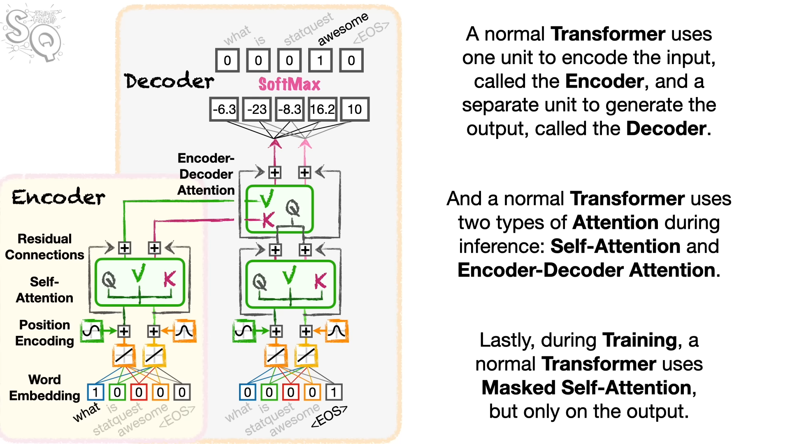

<h1 style="text-align:center;">Building a GPT from scratch : Decoder-Only Transformer</h1>


<u>**Author</u> :** [Younes Dahami](https://www.linkedin.com/in/dahami/)

# I - Introduction

## 1) Tranformer

The **Transformer** is a neural network architecture introduced in the [Attention is All You Need](https://arxiv.org/pdf/1706.03762.pdf) landmark research paper by Vaswani et al in 2017. It revolutionized the field of natural language processing (NLP) by offering a highly <u>**parallelizable**</u> and <u>**efficient**</u> way to process sequential data, such as text. The Transformer model is based on a mechanism called **self-attention**, which allows it to weigh the importance of different parts of the input sequence when generating an output sequence.

At its core, the Transformer consists of an **encoder-decoder architecture**, with multiple layers of self-attention and feedforward neural networks. The encoder processes the input sequence to create contextualized representations, while the decoder generates the output sequence based on these representations. Each layer in the Transformer is designed to capture different levels of abstraction and dependencies within the input sequence.

The key components of the Transformer include :

* <u>**Positional Encoding**</u> **:** Since the Transformer architecture does not inherently understand the order of words in a sequence, positional encodings are added to the input embeddings to provide information about the position of each word.

* <u>**Self-Attention Mechanism**</u> **:** This mechanism allows the model to weigh the importance of each word in the input sequence when generating each word in the output sequence. It computes **attention scores** between all pairs of words in the input sequence and uses them to generate a context vector for each word.

* <u>**Multi-Head Attention**</u> **:** To capture different types of relationships within the input sequence, the Transformer employs multiple attention heads in parallel. Each head learns different attention patterns, enhancing the model's ability to capture diverse dependencies.

* <u>**Feedforward Neural Networks**</u> **:** Each layer in the Transformer contains feedforward neural networks that process the output of the self-attention mechanism. These networks consist of fully connected layers followed by activation functions, allowing the model to capture complex patterns in the data.

* <u>**Layer Normalization and Residual Connections (Add & Norm)**</u> **:** To stabilize training and facilitate the flow of gradients, layer normalization and residual connections are applied after each sublayer in the Transformer.

<center>

</center>


<center>Figure 1: The Transformer - model architecture</center>

**Remark :** The encoder and the decoder both composed of a stack of $N$ identical layers

The Transformer architecture has become the foundation for many state-of-the-art models in NLP, including **BERT**, **GPT**, and **T5**, among others. Its ability to capture long-range dependencies and its parallelizability make it well-suited for a wide range of sequence processing tasks, including machine translation, text generation, sentiment analysis, and more.

## 2) State-of-the-Art NLP Architectures

### a) BERT (Bidirectional Encoder Representations from Transformers)

**BERT** is a transformer-based model introduced by Google in 2018 for natural language understanding tasks. It is pre-trained on large corpora of text using a masked language model (MLM) objective and next sentence prediction (NSP) task.
Its key features include :

* <u>**Bidirectionality**</u> **:** BERT is bidirectional, meaning it can understand the context of a word based on both its left and right context in a sentence.

* <u>**Transformer Architecture**</u> **:** BERT utilizes the transformer architecture, consisting of encoder layers to learn contextual representations of words.

* <u>**Pre-training Objectives**</u> **:** BERT is pre-trained using two main objectives: Masked Language Model (MLM) and Next Sentence Prediction (NSP). MLM involves masking random words in a sentence and predicting them based on the surrounding context. NSP involves predicting whether two sentences are consecutive in the original text.

* <u>**Applications**</u> **:** BERT has been used for various NLP tasks, including text classification, named entity recognition, question answering, and sentiment analysis.

### b) GPT (Generative Pre-trained Transformer)

**GPT** is a series of transformer-based models developed by OpenAI for natural language generation tasks. The models are trained using a causal language modeling objective.
Its key features include :

* <u>**Unidirectionality**</u> **:** GPT is unidirectional, meaning it generates text in a left-to-right manner based only on the preceding context.

* <u>**Transformer Architecture**</u> **:** Like BERT, GPT also utilizes the transformer architecture, but it focuses on decoding rather than encoding.

* <u>**Causal Language Modeling**</u> **:** GPT is pre-trained using a causal language modeling objective, where the model predicts the next word in a sequence given the preceding context.

* <u>**Applications**</u> **:** GPT has been used for tasks such as text generation, story writing, dialogue systems, and language translation.

### c) T5 (Text-To-Text Transfer Transformer)

**T5** is a transformer-based model introduced by Google in 2019. It is designed to unify different NLP tasks into a single text-to-text framework, where each task is treated as a text-to-text mapping problem.
Its key features include :

* <u>**Unified Framework**</u> **:** T5 treats all NLP tasks as text-to-text problems, where both input and output are represented as text strings.

* <u>**Transformer Architecture**</u> **:** Similar to BERT and GPT, T5 utilizes the transformer architecture. However, it is trained to perform various tasks in a single model.

* <u>**Pre-training & Fine-Tuning**</u> **:** T5 is pre-trained using a large corpus of text with a text-to-text objective. It can then be fine-tuned on specific downstream tasks by providing task-specific prompts.

* <u>**Applications**</u> **:** T5 can be applied to a wide range of NLP tasks, including text summarization, machine translation, question answering, and language understanding.

All these models represent significant advancements in natural language processing and have achieved state-of-the-art performance on various benchmarks and tasks in the field of NLP.

## 3) Decoder-Only Transformer

A **Decoder-Only Transformer** is a type of neural network architecture based on the Transformer model, commonly used in NLP tasks such as machine translation and text generation. Unlike the original Transformer architecture, which consists of both encoder and decoder components, a Decoder-Only Transformer only contains the decoder part.

In a typical Transformer model, the encoder processes the input sequence and generates contextual representations, which are then passed to the decoder to generate the output sequence. However, in a Decoder-Only Transformer, <u>**there is no encoder**</u>, instead, the decoder directly generates the output sequence based on the target sequence or token. This means that the model doesn't have access to the source sequence during the decoding process, making it **suitable for tasks where only the target sequence is available during inference**, such as language generation tasks.

Decoder-Only Transformers are often used in scenarios like autoregressive language modeling, where the model predicts the next token in a sequence given the preceding tokens. They are also employed in tasks like text summarization and dialogue generation, where the goal is to generate coherent and contextually relevant output based solely on the provided target information.

<div style="display: flex;">
    
     
</div>
<center>Figure 2: The Transformer model architecture for Encoder-Decoder (left) & Decoder-Only (right) </center>

The two illustrations in Figure 2 are from [Statquest](https://www.statquest.org)

#### Important papers : 

- [Attention is All You Need](https://arxiv.org/pdf/1706.03762.pdf) paper
- [OpenAI GPT-3](https://arxiv.org/pdf/2005.14165.pdf) paper
- [OpenAI ChatGPT](https://openai.com/blog/chatgpt) blog post

# II - Building the Decoder-Only Transformer from scratch

## 1) Importing the data

We always start with a dataset to train on. Let's download the tiny shakespeare dataset :


```python
import os
from urllib.request import urlretrieve

url = "https://raw.githubusercontent.com/karpathy/char-rnn/master/data/tinyshakespeare/input.txt"
urlretrieve(url, './input.txt') # create a text file named input
```


    ('./input.txt', <http.client.HTTPMessage at 0x1956c2c1c00>)


##  2) Reading from the file

To read the contents of a file, we first need to open the file using the built-in function`open` function. The `open()` function returns a file object and provides several methods for interacting with the file's contents. The `open()` function also accepts a `mode` argument to specify how we can interact with the file.


```python
# mode = 'r' : open for reading
# file.read() : to view the contents of the file

with open('./input.txt','r', encoding = 'utf-8') as f :
    text = f.read()
```


```python
# length of the text (in terms of characters)
print(f"The text contains {len(text)} characters")
```

    The text contains 1115394 characters
    


```python
# Let's take look at the first printed 1500 characters in the text
print(text[:1500])
```

    First Citizen:
    Before we proceed any further, hear me speak.
    
    All:
    Speak, speak.
    
    First Citizen:
    You are all resolved rather to die than to famish?
    
    All:
    Resolved. resolved.
    
    First Citizen:
    First, you know Caius Marcius is chief enemy to the people.
    
    All:
    We know't, we know't.
    
    First Citizen:
    Let us kill him, and we'll have corn at our own price.
    Is't a verdict?
    
    All:
    No more talking on't; let it be done: away, away!
    
    Second Citizen:
    One word, good citizens.
    
    First Citizen:
    We are accounted poor citizens, the patricians good.
    What authority surfeits on would relieve us: if they
    would yield us but the superfluity, while it were
    wholesome, we might guess they relieved us humanely;
    but they think we are too dear: the leanness that
    afflicts us, the object of our misery, is as an
    inventory to particularise their abundance; our
    sufferance is a gain to them Let us revenge this with
    our pikes, ere we become rakes: for the gods know I
    speak this in hunger for bread, not in thirst for revenge.
    
    Second Citizen:
    Would you proceed especially against Caius Marcius?
    
    All:
    Against him first: he's a very dog to the commonalty.
    
    Second Citizen:
    Consider you what services he has done for his country?
    
    First Citizen:
    Very well; and could be content to give him good
    report fort, but that he pays himself with being proud.
    
    Second Citizen:
    Nay, but speak not maliciously.
    
    First Citizen:
    I say unto you, what he hath done famously, he did
    it to that end: though soft-conscienced men can be
    content to 
    

## 3) Building the dataset

First, let's create our vocabulary that we're going to work with :


```python
# All the unique character that occur in the text
chars = sorted(list(set(text)))  # vocabulary
vocab_size = len(chars)

print(''.join(chars))
print(f"The total number of unique characters in the text : {vocab_size}")  # nb of tokens
```

    
     !$&',-.3:;?ABCDEFGHIJKLMNOPQRSTUVWXYZabcdefghijklmnopqrstuvwxyz
    The total number of unique characters in the text : 65
    

After creating our vacabulary, we have to build our encoder and decoder, where :

The **Encoder** takes a string `s` of characters `c`, and outputs a list of integers, where each integer represent the character's index in the vocabulary. Meanwhile, the **Decoder** takes a list `l` of integers `i` and turn it into characters before joining them to output a string.


```python
# create a mapping from characters to integers
stoi = { ch:i for i,ch in enumerate(chars) }

# mapping from integers to characters
itos = { i:ch for i,ch in enumerate(chars) }

# chracter-level tokenizer
# encoder: takes a string turns it into a lis of integers
encode = lambda s: [stoi[c] for c in s] 
# decoder: takes a list of integers turns it into a string
decode = lambda l: ''.join([itos[i] for i in l]) 

print(encode("hii there"))
print(decode(encode("hii there")))
```

    [46, 47, 47, 1, 58, 46, 43, 56, 43]
    hii there
    

Let's now encode the entire text dataset and store it into a `torch.Tensor` :


```python
import torch
data = torch.tensor(encode(text), dtype = torch.long)
print(data.shape, data.dtype)

# the 1500 characters we looked at earlier that will go the GPT look like this
print(data[:1500])
```

    torch.Size([1115394]) torch.int64
    tensor([18, 47, 56,  ..., 58, 53,  1])
    

## 4) Splitting the dataset

Let's now split up the data into **$90\%$ training** and **$10\%$ evaluation** sets :


```python
n = int(0.9*len(data))

# Training data : includes the inputs & targets (ground truths)
train_data = data[:n]  # 90%

# Evaluation data : includes the inputs & targets (ground truths)
val_data = data[n:]    # the rest : 10%
```


```python
print(f"Training data shape : {train_data.shape}")
print(f"Validation data shape : {val_data.shape}")
```

    Training data shape : torch.Size([1003854])
    Validation data shape : torch.Size([111540])
    


```python
# context length (the time dimension T in (B,T,C))
block_size = 8
train_data[:block_size]
```


    tensor([18, 47, 56, 57, 58,  1, 15, 47])


We're going to feed `block_size` characters (in this example : 8) to our transformer. In fact, each input example, has `block_size` examples in it :


```python
X = train_data[:block_size]     # the input to the transformer
y = train_data[1:block_size+1]  # targets for each position (ground truths)

print(f"The shape of the input : {X.shape}")
print(f"The shape of the target : {y.shape}")
```

    The shape of the input : torch.Size([8])
    The shape of the target : torch.Size([8])
    


```python
for t in range(block_size) :
    context = X[:t+1]    # X[0], X[1],..., X[t] (t+1 is excluded)
    target = y[t]
    
    print(f"when input is {context} the target: {target}")
```

    when input is tensor([18]) the target: 47
    when input is tensor([18, 47]) the target: 56
    when input is tensor([18, 47, 56]) the target: 57
    when input is tensor([18, 47, 56, 57]) the target: 58
    when input is tensor([18, 47, 56, 57, 58]) the target: 1
    when input is tensor([18, 47, 56, 57, 58,  1]) the target: 15
    when input is tensor([18, 47, 56, 57, 58,  1, 15]) the target: 47
    when input is tensor([18, 47, 56, 57, 58,  1, 15, 47]) the target: 58
    

Let's now build a uitility function that splits our training/evaluation data into **inputs** and **targets** for our transformer model, and let's call it `get_batch` :


```python
torch.manual_seed(1989)  # for reproducibility

batch_size = 4           # B : how many independent sequences will we process in parallel?
block_size = 8           # T : what is the maximum context length for predictions?

def get_batch(split):
    """given a split (which is 'train' or 'val') this function will generate
       a small batch of data of inputs X and targets y"""
    
    
    data = train_data if split == 'train' else val_data
    
    # sampling random locations in the dataset to pull chunks (of size batch_size) from, between 0 and 'len(data) - block_size'
    ix = torch.randint(len(data) - block_size, (batch_size,)) # shape(batch_size) = B
    
    # Extract the rows & stack them to become (B,T)=(batch_size,block_size) 2D-tensors
    X = torch.stack([data[i:i+block_size] for i in ix])     # we stack (vertically) the 'B' vectors of dimension T ---> shape(B,T)
    y = torch.stack([data[i+1:i+block_size+1] for i in ix]) # because each example has multiple examples in it; shape(B,T)
    return X, y


#---------------------------------------------------

Xb, yb = get_batch('train')  # b for batch
print('inputs:')
print(Xb.shape)
print(Xb)
print('targets:')
print(yb.shape)
print(yb)

print('-----------------')

for b in range(batch_size): # across the batch dimension (row dim) B
    for t in range(block_size): # across the time dimension (col dim) T
        context = Xb[b, :t+1]
        target = yb[b,t]
        print(f"when the input is {context.tolist()} the target: {target}")
```

    inputs:
    torch.Size([4, 8])
    tensor([[ 1, 61, 47, 50, 50,  1, 42, 43],
            [43,  1, 58, 46, 43,  1, 50, 53],
            [42, 63, 40, 47, 56, 42,  2,  0],
            [46, 39, 58,  1, 39, 56, 58,  1]])
    targets:
    torch.Size([4, 8])
    tensor([[61, 47, 50, 50,  1, 42, 43, 57],
            [ 1, 58, 46, 43,  1, 50, 53, 39],
            [63, 40, 47, 56, 42,  2,  0, 19],
            [39, 58,  1, 39, 56, 58,  1, 58]])
    -----------------
    when the input is [1] the target: 61
    when the input is [1, 61] the target: 47
    when the input is [1, 61, 47] the target: 50
    when the input is [1, 61, 47, 50] the target: 50
    when the input is [1, 61, 47, 50, 50] the target: 1
    when the input is [1, 61, 47, 50, 50, 1] the target: 42
    when the input is [1, 61, 47, 50, 50, 1, 42] the target: 43
    when the input is [1, 61, 47, 50, 50, 1, 42, 43] the target: 57
    when the input is [43] the target: 1
    when the input is [43, 1] the target: 58
    when the input is [43, 1, 58] the target: 46
    when the input is [43, 1, 58, 46] the target: 43
    when the input is [43, 1, 58, 46, 43] the target: 1
    when the input is [43, 1, 58, 46, 43, 1] the target: 50
    when the input is [43, 1, 58, 46, 43, 1, 50] the target: 53
    when the input is [43, 1, 58, 46, 43, 1, 50, 53] the target: 39
    when the input is [42] the target: 63
    when the input is [42, 63] the target: 40
    when the input is [42, 63, 40] the target: 47
    when the input is [42, 63, 40, 47] the target: 56
    when the input is [42, 63, 40, 47, 56] the target: 42
    when the input is [42, 63, 40, 47, 56, 42] the target: 2
    when the input is [42, 63, 40, 47, 56, 42, 2] the target: 0
    when the input is [42, 63, 40, 47, 56, 42, 2, 0] the target: 19
    when the input is [46] the target: 39
    when the input is [46, 39] the target: 58
    when the input is [46, 39, 58] the target: 1
    when the input is [46, 39, 58, 1] the target: 39
    when the input is [46, 39, 58, 1, 39] the target: 56
    when the input is [46, 39, 58, 1, 39, 56] the target: 58
    when the input is [46, 39, 58, 1, 39, 56, 58] the target: 1
    when the input is [46, 39, 58, 1, 39, 56, 58, 1] the target: 58
    


```python
# Our batch of input to the transformer
print(xb) 
```

    tensor([[ 1, 61, 47, 50, 50,  1, 42, 43],
            [43,  1, 58, 46, 43,  1, 50, 53],
            [42, 63, 40, 47, 56, 42,  2,  0],
            [46, 39, 58,  1, 39, 56, 58,  1]])
    

Th transformer will process `batch_size` (in this example 4) strings of `block_size` (in this example 8) characters simultaneously.

## 5) Building the model

In this section, we're going to construct our model and 'Pytorchify' the code, which involves making the code more similar to the conventions found in PyTorch.

3D-Tensor's dimensions :

* **B :** represents the batch dimension, indicating the number of samples in each batch.
* **T :** represents the time dimension or sequence length, indicating the number of tokens or words in each sequence.
* **C :** represents the channels dimension, often used to represent the embedding dimension or the vocabulary size.


```python
import torch
import torch.nn as nn
from torch.nn import functional as F
torch.manual_seed(1989)

# B : Batch dimension (batch_size),
# T : Time dimension (block_size =  context_size),
# C : Channels dimension (vocab_size) embedding dimension
# REMARK : in this project we're working with (B,T,C) 3D-tensors, but in Pytorch & Tensorflow they work with (B,C,T) 3D-tensors

#--------------------------------------------------------------------------------------------------

class BigramLanguageModel(nn.Module):
    
    def __init__(self, vocab_size) :
        super().__init__()  # inherets additional attributes from nn.Module
        # each token directly reads off the logits for the next token from a lookup table
        self.token_embedding_table = nn.Embedding(vocab_size, vocab_size) #(vocab_size, C)

    def forward(self, idx, targets = None) :
        # 'idx' (inputs) and 'targets' are both (B,T) shaped 2D-tensors of integers
        logits = self.token_embedding_table(idx) # (B,T) -----> (B,T,C)
        if targets is None :
            loss = None
        else:
            B, T, C = logits.shape
            logits = logits.view(B*T, C)  # reshaping the logits : (B,T,C)---> (B*T,C) that's how pytorch's crossentropy treats the logits dim in crossentropy 
            targets = targets.view(B*T)   # reshaping the targets : (B,T)----> B*T
            loss = F.cross_entropy(logits, targets)  # loss
        return logits, loss

    def generate(self, idx, max_new_tokens):
        """ 'idx' is (B, T)-array of indices in the current context in some batch.
        The job of generate is basically to take (B,T) and extend it to be (B,T+1), (B,T+2)....
        it basically continues the generation in all the Batch dimensions in the Time dimension. It will do
        that for  'max_new_tokens' """
        
        for _ in range(max_new_tokens) :
            # get the predictions
            logits, loss = self(idx)  # the forward method is automatically applied
            # focus only on the last time step (hence -1)
            logits = logits[:, -1, :] # (B,T,C)--->(B, C) 
            # apply softmax on the last dimension (C, hence -1) to get probabilities
            probs = F.softmax(logits, dim = -1) # (B, C)=(batch_size, vocab_size)
            # sample from the distribution
            idx_next = torch.multinomial(probs, num_samples = 1) # (B, C)-->(B, 1) because from each row we sample one outcome (the next index)
            # append sampled index to the running sequence
            idx = torch.cat((idx, idx_next), dim = 1) # (B, T) & (B,1)----concatenation--->(B, T+1)...--->(B, T+max_new_tokens)
        return idx

    
    
#-----------------------------------------------------------

# Calculate the loss before training    
m = BigramLanguageModel(vocab_size)   # '__init__' is automatically applied : an embedding table (65,65) is created
logits, loss = m(Xb, yb)              # 'forward' is automatically applied
print(f"Shape of logits after forward is applied : {logits.shape}")
print(loss)


# Generate 100 tokens without training the model
print(decode(m.generate(idx = torch.zeros((1, 1), dtype = torch.long), max_new_tokens = 100)[0].tolist()))  
```

    Shape of logits after forward is applied : torch.Size([32, 65])
    tensor(4.8965, grad_fn=<NllLossBackward0>)
    
    Fxl3a!s.WkwD-Nb,ISnTXZYHx$O&VE',j'MlQwamcIw$YlyoKagTW
    
    
    $OBz!Pcn OVH?v?V$wDlpQBrCxHQODEBXsWvh'-aoNaz
    

`idx = torch.zeros((1, 1),dtype=torch.long)` creates a torch tensor of shape(1,1) of type integers, with 0 in it, to kick off the generation. We index by `[0]` to unplack the single batch (because we worked with 1 batch) dimension that exists, and we convert it to a list to feed it to `decode`.

# Remark : Why do we sample from a multinomial distribution  ?

Using the maximum probability token at each step during generation, also known as <u>**greedy decoding**</u>, can lead to suboptimal results in certain scenarios. Here's why sampling from the multinomial distribution is preferred over greedy decoding :

* **Diversity :** Greedy decoding tends to produce repetitive or deterministic outputs because it always selects the token with the highest probability. This can result in generated sequences lacking diversity and variety. Sampling from the multinomial distribution allows for randomness in token selection, introducing diversity in the generated outputs.

* **Exploration :** Sampling encourages the model to explore different possibilities in the output space. By considering tokens with lower probabilities, the model has the opportunity to generate alternative sequences that may not be immediately apparent based on the highest probability tokens alone. This exploration can lead to more creative and diverse outputs.

* **Handling Uncertainty :** In some cases, the model may have high uncertainty about the next token to generate, with multiple tokens having relatively high probabilities. Sampling allows the model to express this uncertainty by considering multiple tokens with non-negligible probabilities, rather than committing to a single token deterministically.

* **Avoiding Mode Collapse :** Greedy decoding is susceptible to mode collapse, where the model repeatedly generates similar or identical sequences. Sampling helps mitigate this issue by introducing randomness into the generation process, preventing the model from getting stuck in repetitive patterns.

Overall, sampling from the multinomial distribution provides a more flexible and exploratory approach to sequence generation, allowing the model to produce diverse and varied outputs while handling uncertainty and avoiding mode collapse.

## 6) Training the model


```python
# create a PyTorch optimizer
optimizer = torch.optim.AdamW(m.parameters(), lr = 1e-3)
```


```python
batch_size = 32

for steps in range(1000): # increase number of steps for good results...

    # sample a batch of data
    Xb, yb = get_batch('train')

    # evaluate the loss
    logits, loss = m(xb, yb)
    
    # zeroing out all the gradients from the previous step
    optimizer.zero_grad(set_to_none = True)
    
    # getting the gradients for all the parameters
    loss.backward()
    
    # using those gradients to update our parameters
    optimizer.step()

# Print the final loss
print(loss.item())
```

    3.752437114715576
    

Let's generate 500 tokens after this first training :


```python
print(decode(m.generate(idx = torch.zeros((1, 1), dtype=torch.long), max_new_tokens=500)[0].tolist()))
```

    
    ILZ;o!xgi,IfneEUBD-cFie F;Dcms,Ldnt EJMeey,rr  Bd AxUMfnCAZsGIiodmm:
    liSJ,?VLnKd !'tGq$JD
    WJZLo li.:
    WPro w,  rET-E'SNaks-QJWnNDXDI'vZQu!kj.j
    tdj-3;w a
    GqOHe?!P3Apsn3' M  lJ.p3C, E's.fn?HQKWAGSMcc. o,LjHdjUlf,QSIQqODGUlfsixsTOUI;a
    F&l:nIQUTAk
    ICcaU iedlYieexw ppl3:
    xY;u:SVcXqyTC!LIld.klI.yv?yv!f ruks A&Oc
    re$H&DWjHDORN'ilRcowpecBJ-GfAh:uQBx
    o olYI$::C!seion3cfGOIdTGRlt WESrtieclPyHCO'KOIwliULX3Fqnggph'YBpyNPFRM
    lolr?jChmep$.aAksid TInp3iGil,IGI'grV? ClyoPtC!&jM?jBvIZaVGIt.SIdSe w 
    by, t e?iNuOyp
    

### a) The Mathematical Trick in Self-Attention


```python
# consider the following toy example:

torch.manual_seed(1989)
B,T,C = 4,8,2 # batch, time (context), channels (embedding_size)
X = torch.randn(B,T,C)   # 3D-tensor filled with random numbers from a standard normal distribution

print(X)
print(X.shape)
```

    tensor([[[ 0.8097, -0.1067],
             [-0.4749, -0.4006],
             [-1.4039, -0.1104],
             [ 0.7262, -0.4025],
             [ 1.4481,  0.9492],
             [ 1.0304, -0.3663],
             [-0.3690,  0.6537],
             [ 0.9952,  1.4014]],
    
            [[ 0.1133, -2.4801],
             [ 1.0788,  0.8122],
             [-1.0402,  0.0253],
             [-0.2241, -0.4291],
             [-0.2994,  0.1843],
             [ 0.1031, -0.6406],
             [-0.0708,  0.3859],
             [ 0.4271, -1.3242]],
    
            [[-0.3533, -0.8130],
             [ 0.4300, -0.0615],
             [ 1.2262, -0.5112],
             [ 0.6099,  0.1949],
             [ 0.1370,  0.5844],
             [ 0.1822,  0.0621],
             [-0.7569, -0.5141],
             [-0.7620, -1.7349]],
    
            [[ 0.2587, -2.2229],
             [ 0.9285,  0.0336],
             [-0.8256,  0.9959],
             [ 0.0420, -0.7232],
             [ 1.0993, -0.5001],
             [ 1.0548, -1.4340],
             [-0.3470, -0.5874],
             [-0.1756, -1.8884]]])
    torch.Size([4, 8, 2])
    

These $8$ tokens are not "talking" to each other, but we want them to talk to each other, in such a way that token $t$ only communicates with with previous tokens and itself, and it should not communicate with tokens after it, because those are future tokens in the sequence, **no information come from the future because we're about to predict the future.** (masked attention for decoder-only transformer)

   
   

The easiest way for tokens to communicate, is calculating the average. So for example, if I'm the $5th$ token $t_5$, I would like to take the channels that are information at my step (the $5th$), but also the channels from the $4th$ step, $3rd$...$1st$ step, meaning ($t_4$, $t_3$, $t_2$, $t_1$), and I would like to average those up, and that would become sort of like a **feature vector that summarizes me in the context of my history.** 


<u>**ALERT :**</u> Calculating the average is actually extremely weak and lossy form of interaction, where we lose a ton of information about the spatial arrangement of all those tokens, but that's ok for now, we'll see how to bring that information back later.

For now, what we would like to do is : For every single batch element independently, for every $t-th$ token in that sequence, we'd like to calculate the average of all the vectors in all the previous tokens and the current token ($i\leq t$).


```python
# We want X[b,t] = mean_{i<=t} x[b,i] 
# bow : bag of words
X_bow = torch.zeros((B,T,C))  # shape(B,T,C)
for b in range(B):
    for t in range(T):
        X_prev = X[b,:t+1] # shape(t,C)
        X_bow[b,t] = torch.mean(X_prev, 0)   # The average accross the T dimension
```


```python
# first element of the batch 
X[0]  #(T,C)
```


    tensor([[ 0.8097, -0.1067],
            [-0.4749, -0.4006],
            [-1.4039, -0.1104],
            [ 0.7262, -0.4025],
            [ 1.4481,  0.9492],
            [ 1.0304, -0.3663],
            [-0.3690,  0.6537],
            [ 0.9952,  1.4014]])


```python
X_bow[0]          # averging the x[0] across the T dimension
```


    tensor([[ 0.8097, -0.1067],
            [ 0.1674, -0.2536],
            [-0.3564, -0.2059],
            [-0.0857, -0.2550],
            [ 0.2211, -0.0142],
            [ 0.3559, -0.0729],
            [ 0.2524,  0.0309],
            [ 0.3452,  0.2022]])


Each $i-th$ row from `xbow[0]` is the average of the rows $0$,$1$,...,$i$ from `x[0]`

## b) Calculating The Average Using Matrix Multiplication For a Weighted Aggregation


```python
# triangular lower portion
torch.tril(torch.ones(3, 3))
```


    tensor([[1., 0., 0.],
            [1., 1., 0.],
            [1., 1., 1.]])


```python
# toy example illustrating how matrix multiplication can be used for a "weighted aggregation"
torch.manual_seed(25)

# these 2 lines of a, will help us calculate the averages 
a = torch.tril(torch.ones(3, 3))    # triangular lower portion : shape(3, 3)
a = a / torch.sum(a, 1, keepdim = True)  # shape(3, 3) : every row of 'a' sums to 1

b = torch.randint(0,10,(3,2)).float()  # shape(3,2)
c = a @ b  # shape(3, 3) @ shape(3,2) ---> shape(3,2)

print("a = ")
print(a)
print("-------")
print("b = ")
print(b)
print("-------")
print("c = ")
print(c)
```

    a = 
    tensor([[1.0000, 0.0000, 0.0000],
            [0.5000, 0.5000, 0.0000],
            [0.3333, 0.3333, 0.3333]])
    -------
    b = 
    tensor([[2., 6.],
            [8., 5.],
            [7., 8.]])
    -------
    c = 
    tensor([[2.0000, 6.0000],
            [5.0000, 5.5000],
            [5.6667, 6.3333]])
    

We use the triangular matrix so that each $i-th$ row from `c`, is the average of the rows $0,1,...i$ from `b`.


```python
torch.tril(torch.ones(T, T))  # shape(8,8)
```


    tensor([[1., 0., 0., 0., 0., 0., 0., 0.],
            [1., 1., 0., 0., 0., 0., 0., 0.],
            [1., 1., 1., 0., 0., 0., 0., 0.],
            [1., 1., 1., 1., 0., 0., 0., 0.],
            [1., 1., 1., 1., 1., 0., 0., 0.],
            [1., 1., 1., 1., 1., 1., 0., 0.],
            [1., 1., 1., 1., 1., 1., 1., 0.],
            [1., 1., 1., 1., 1., 1., 1., 1.]])


```python
# version 2 : using matrix multiply for a weighted aggregation
# wei short for weights

wei = torch.tril(torch.ones(T, T))
wei = wei / wei.sum(1, keepdim=True)   # shape(T, T) : tril and every row sums up to 1
X_bow2 = wei @ X                       # (T, T) @ (B, T, C)-----Pytorch----->(B, T, T) @ (B, T, C) ----> (B, T, C)
torch.allclose(X_bow, X_bow2)          # True
```


    True


<u>**Explanation of (B, T, T) @ (B, T, C) ----> (B, T, C)**</u> **:**

In reality, it's **(T, T) @ (B, T, C)**, but Pytorch will come and see that these shapes are not the same, so it will create a batch dimension in **(T, T)**, the mulitplication becomes **(B, T, T) @ (B, T, C)**. And `@` is a **batched matrix multiply**, and so it will apply this matrix multiplication in all the batch elements in **parallel** and **individually**. And then for each batch element there will be a **(T, T) @ (T, C)**, exactly what we had above.

## c) Using Softmax


```python
# version 3: use Softmax
tril = torch.tril(torch.ones(T, T))   # shape(T,T)
wei = torch.zeros((T,T))              # shape(T,T)
print(f"The weight matrix : {wei}")

# all the 'tril' elements which are equal to zero, make them equal to '-inf'
wei = wei.masked_fill(tril == 0, float("-inf"))   # shape(T,T)

# exponentiate every element of 'wei' and divide by their sum (the future cannot communicate with the past)
wei = F.softmax(wei, dim = -1)  # dim = -1 refers to the last dimension of 'wei'
print(f"The weight matrix : {wei}")

X_bow3 = wei @ X  # (T,T)@(B,T,C)--->(B,T,T)@(B,T,C)--->(B,T,C)
print(X_bow3.shape)
torch.allclose(X_bow, X_bow3)  # True
```

    The weight matrix : tensor([[0., 0., 0., 0., 0., 0., 0., 0.],
            [0., 0., 0., 0., 0., 0., 0., 0.],
            [0., 0., 0., 0., 0., 0., 0., 0.],
            [0., 0., 0., 0., 0., 0., 0., 0.],
            [0., 0., 0., 0., 0., 0., 0., 0.],
            [0., 0., 0., 0., 0., 0., 0., 0.],
            [0., 0., 0., 0., 0., 0., 0., 0.],
            [0., 0., 0., 0., 0., 0., 0., 0.]])
    The weight matrix : tensor([[1.0000, 0.0000, 0.0000, 0.0000, 0.0000, 0.0000, 0.0000, 0.0000],
            [0.5000, 0.5000, 0.0000, 0.0000, 0.0000, 0.0000, 0.0000, 0.0000],
            [0.3333, 0.3333, 0.3333, 0.0000, 0.0000, 0.0000, 0.0000, 0.0000],
            [0.2500, 0.2500, 0.2500, 0.2500, 0.0000, 0.0000, 0.0000, 0.0000],
            [0.2000, 0.2000, 0.2000, 0.2000, 0.2000, 0.0000, 0.0000, 0.0000],
            [0.1667, 0.1667, 0.1667, 0.1667, 0.1667, 0.1667, 0.0000, 0.0000],
            [0.1429, 0.1429, 0.1429, 0.1429, 0.1429, 0.1429, 0.1429, 0.0000],
            [0.1250, 0.1250, 0.1250, 0.1250, 0.1250, 0.1250, 0.1250, 0.1250]])
    torch.Size([4, 8, 2])
    


    True


## 7) Self-Attention


```python
# version 4: self-attention!
torch.manual_seed(1989)

# batch, time, channels : we have one batch of B=4 examples, each example is composed of T=8 tokens, each tokens is represented in C-dim =32-dim embedding
B,T,C = 4,8,32 
X = torch.randn(B,T,C)  #(B,T,C)

# let's see a single Head perform self-attention
head_size = 16
key = nn.Linear(C, head_size, bias = False) # dim_input=C, and dim_output=head_size
query = nn.Linear(C, head_size, bias = False) # bias=False means we're just doing a matrix multiplication
value = nn.Linear(C, head_size, bias = False)

# all the tokens in all the positions in (B,T) arrangements will produce (in parallel and independetly) a key and a query
# no communication has happened yet
k = key(X)   # 'X' : (B,T,32)----linear projection of 'X'---> 'k' : (B, T, 16)
q = query(X) # 'X' : (B,T,32)----linear projection of 'X'---> 'q' : (B, T, 16)

# communication will happen now, we transpose 'k' in the 2nd and 3rd dimensions
# we're applying '.T' so that the dimensiosn of 'q' and 'k' allign
wei =  q @ k.transpose(-2, -1) # (B, T, 16) @ (B, 16, T) ---> (B, T, T)

# to avoid the communication with the future : Masked self-attention
tril = torch.tril(torch.ones(T, T))
#wei = torch.zeros((T,T))
wei = wei.masked_fill(tril == 0, float('-inf'))

# Calculate similiraty scores (also called 'weights')
wei = F.softmax(wei, dim = -1)  # (T,T) : each row sums up to 1

# Calculate attention scores
v = value(X)    # 'X' : (B,T,32)----linear projection of 'X'---> 'k' : (B, T, 16)
out = wei @ v   # (T,T)@(B, T, 16)-->(B,T,T)@(B,T,16)------->(B,T,16)
#out = wei @ X

out.shape
```


    torch.Size([4, 8, 16])


```python
# Represention of the similarity scores for the first example in the batch
wei[0]
```


    tensor([[1.0000, 0.0000, 0.0000, 0.0000, 0.0000, 0.0000, 0.0000, 0.0000],
            [0.4555, 0.5445, 0.0000, 0.0000, 0.0000, 0.0000, 0.0000, 0.0000],
            [0.4064, 0.2620, 0.3317, 0.0000, 0.0000, 0.0000, 0.0000, 0.0000],
            [0.1848, 0.1477, 0.1866, 0.4810, 0.0000, 0.0000, 0.0000, 0.0000],
            [0.1926, 0.4573, 0.1975, 0.1488, 0.0039, 0.0000, 0.0000, 0.0000],
            [0.2538, 0.1568, 0.3911, 0.1029, 0.0299, 0.0654, 0.0000, 0.0000],
            [0.0783, 0.0362, 0.4167, 0.0047, 0.0040, 0.0586, 0.4015, 0.0000],
            [0.0714, 0.0753, 0.2513, 0.0920, 0.0418, 0.2746, 0.0480, 0.1456]],
           grad_fn=<SelectBackward0>)


<u>**NOTES**</u> **:**
- Attention is a **communication mechanism**, it can be seen as nodes in a directed graph looking at each other and aggregating information with a weighted sum from all nodes that point to them, with data-dependent weights.

- There is no notion of space, Attention simply acts over a set of vectors. **This is why we need to positionally encode tokens before.**

- Each example across batch dimension is, of course, processed completely **independently** and never "talk" to each other.

- For an **encoder-attention block**, we just delete the single line that does the masking with `tril`, allowing all tokens to communicate. This block that we saw here is called a **decoder-attention block** because it has **triangular masking**, and is usually used in autoregressive settings, like language modeling.

- **Self-attention** just means that the "keys" and "values" are produced from the same source as "queries". In **cross-attention**, the queries still get produced from `X`, but the "keys" and "values" come from some other, external source (e.g. an encoder module).

- **Scaled attention additional** divides `wei` by $1/\sqrt(HeadSize)$. This makes it so when input $Q, K$ are unit variance ($Var(Q)=Var(K)=1$), `wei` will be unit variance too and Softmax will stay diffuse and not saturate too much. Illustration below :


```python
# sampling 'k' and 'q' from standard normal distribution
k = torch.randn(B,T,head_size) 
q = torch.randn(B,T,head_size)

wei = q @ k.transpose(-2, -1) * head_size**-0.5
```


```python
k.var(), q.var(), wei.var()
```


    (tensor(0.9632), tensor(1.0314), tensor(1.0345))


<u>**Remark**</u> **:** When the variance diverges from $1$ the softmax gets too peaky, it converges to **one-hot** as seen in the example below :


```python
torch.softmax(torch.tensor([0.1, -0.2, 0.3, -0.2, 0.5]), dim = -1)
```


    tensor([0.1925, 0.1426, 0.2351, 0.1426, 0.2872])


```python
(torch.softmax(torch.tensor([0.1, -0.2, 0.3, -0.2, 0.5]), dim = -1)).sum()
```


    tensor(1.)


```python
print(torch.softmax(torch.tensor([0.1, -0.2, 0.3, -0.2, 0.5])*8, dim = -1))
print(torch.softmax(torch.tensor([0.1, -0.2, 0.3, -0.2, 0.5])*10, dim = -1))
print(torch.softmax(torch.tensor([0.1, -0.2, 0.3, -0.2, 0.5])*15, dim = -1))
print(torch.softmax(torch.tensor([0.1, -0.2, 0.3, -0.2, 0.5])*100, dim = -1))
```

    tensor([0.0326, 0.0030, 0.1615, 0.0030, 0.8000])
    tensor([1.5851e-02, 7.8918e-04, 1.1713e-01, 7.8918e-04, 8.6545e-01])
    tensor([2.3555e-03, 2.6167e-05, 4.7312e-02, 2.6167e-05, 9.5028e-01])
    tensor([4.2484e-18, 3.9754e-31, 2.0612e-09, 3.9754e-31, 1.0000e+00])
    

## 8) Normalization 

The statement :

<center> "The normalization layer normalizes the output of the attention mechanisms to stabilize training"</center>

is partly correct. Normalization layers, such as layer normalization or batch normalization, are indeed used in transformer architectures to stabilize training. However, their primary purpose is not specifically to normalize the output of the attention mechanisms. Instead, **Normalization layers are typically applied after each sub-layer within the transformer block to stabilize the gradients and improve the training dynamics of the entire network.**

In the context of transformer models, normalization layers are commonly inserted after the "self-attention mechanism" and the "feed-forward neural network (FFNN)" sub-layers. These layers help mitigate issues such as the vanishing or exploding gradient problem and facilitate smoother optimization during training.

So, while normalization layers play a crucial role in stabilizing training in transformer architectures, their function is broader than just normalizing the output of attention mechanisms. They contribute to the overall stability and efficiency of the training process for the entire model.


```python
class LayerNorm1d :
    # (used to be BatchNorm1d) identical to layernorm in Pytorch
    # Nomalizing rows instead of columns (like in the "BatchNorm1d" class from my other project "Building makemore (III) : Activations & Gradients, BatchNorm)""
    def __init__(self, dim, eps=1e-5, momentum=0.1) :  
        self.eps = eps                  # epsilon term in the normalization
        self.gamma = torch.ones(dim)    # gain
        self.beta = torch.zeros(dim)    # bias

    def __call__(self, X) :
        # calculate the forward pass
        X_mean = X.mean(1, keepdim=True) # batch mean ; shape(X) = (B,T,C)
        X_var = X.var(1, keepdim=True) # batch variance ; shape(X)
        X_hat = (X - X_mean) / torch.sqrt(X_var + self.eps) # normalize to unit variance (B,T,C)
        self.out = self.gamma * X_hat + self.beta # same shape(X) = (B,T,C); '*' is a element-wise multiplication
        return self.out

    def parameters(self) :
        return [self.gamma, self.beta]  # trainable parameters

torch.manual_seed(1989)
module = LayerNorm1d(100)
X = torch.randn(32, 100) # batch size 32 of 100-dimensional vectors
X = module(X)
X.shape
```


    torch.Size([32, 100])


```python
X[:,0].mean(), X[:,0].std() # mean,std of one feature across all batch inputs, (not normalized) (1st column)
```


    (tensor(-0.2395), tensor(0.8673))


```python
X[0,:].mean(), X[0,:].std() # mean,std of a single input from the batch, of its features, (normalized) (1st row)
```


    (tensor(-3.8147e-08), tensor(1.0000))


```python
# French to English translation example:
# Encoder-decoder tranformer
# <--------- ENCODE ------------------><--------------- DECODE ----------------->
# J'ai appris beaucoup sur l'apprentissage profond. <START> I have learned a lot about deep learning.<END>
```

# III - Complete code for reference - Text Generation


```python
import torch
import torch.nn as nn
from torch.nn import functional as F

# hyperparameters
batch_size = 16           # how many independent sequences will we process in parallel
block_size = 32           # what is the maximum context length for predictions
max_iters = 5000          # max number of iterations in training
eval_interval = 100       # every once in a while (intervals of size 'eval_interval') evaluate the loss on 'train' and 'val' sets
learning_rate = 1e-3
device = 'cuda' if torch.cuda.is_available() else 'cpu' # The ability to run on a 'GPU' if we have it : use 'cuda' instead of cpu, for faster computations 
eval_iters = 200
n_embd = 64               # embedding dimension (C)
n_head = 4                # number of heads
n_layer = 4               # 4 layers
dropout = 0.0             # regularization
# -------------------------------------------------

torch.manual_seed(1989)

# upload the file
with open('input.txt', 'r', encoding='utf-8') as f:
    text = f.read()

# here are all the unique characters that occur in this text
chars = sorted(list(set(text)))
vocab_size = len(chars)
# create a mapping from characters to integers
stoi = { ch:i for i,ch in enumerate(chars) }
itos = { i:ch for i,ch in enumerate(chars) }
encode = lambda s: [stoi[c] for c in s] # encoder: take a string, output a list of integers
decode = lambda l: ''.join([itos[i] for i in l]) # decoder: take a list of integers, output a string

# Train and test splits
data = torch.tensor(encode(text), dtype=torch.long)
n = int(0.9*len(data)) # first 90% will be train, rest val
train_data = data[:n]
val_data = data[n:]

# data loading
def get_batch(split):
    # generate a small batch of data of inputs x and targets y
    data = train_data if split == 'train' else val_data
    ix = torch.randint(len(data) - block_size, (batch_size,))
    x = torch.stack([data[i:i+block_size] for i in ix])
    y = torch.stack([data[i+1:i+block_size+1] for i in ix])
    x, y = x.to(device), y.to(device)  # if cuda is used, we move the data to device
    return x, y

@torch.no_grad() # this context manager torch.no_grad tells Pytroch that everything that happens inside the function "estimate_loss", we will not call .backward() on.
def estimate_loss():
    """it averages up the loss over multiple batches"""
    
    out = {} # empty dict for losses for each iteration in the evaluation
    model.eval() # setting the model into evaluation phase
    for split in ['train', 'val']:
        losses = torch.zeros(eval_iters)
        for k in range(eval_iters):
            X, Y = get_batch(split)
            logits, loss = model(X, Y) # outputs of .forward method in "BigramLanguageModel" class 
            losses[k] = loss.item()
        out[split] = losses.mean()
    model.train() # resetting the model into training phase
    return out

class Head(nn.Module):
    """ one head of self-attention """

    def __init__(self, head_size):
        super().__init__() # inhereting additional attributes from "nn.Module"
        self.key = nn.Linear(n_embd, head_size, bias=False)
        self.query = nn.Linear(n_embd, head_size, bias=False)
        self.value = nn.Linear(n_embd, head_size, bias=False)
        self.register_buffer('tril', torch.tril(torch.ones(block_size, block_size)))

        self.dropout = nn.Dropout(dropout) # regularization

    def forward(self, x):
        B,T,C = x.shape
        k = self.key(x)   # (B,T,C)
        q = self.query(x) # (B,T,C)
        # compute attention scores ("affinities") : No communication with the future
        wei = q @ k.transpose(-2,-1) * C**-0.5 # (B, T, C) @ (B, C, T) -> (B, T, T) # head_size**-0.5 for scaling
        wei = wei.masked_fill(self.tril[:T, :T] == 0, float('-inf')) # (B, T, T)
        wei = F.softmax(wei, dim=-1) # (B, T, T)
        wei = self.dropout(wei) # regularization
        # perform the weighted aggregation of the values
        v = self.value(x) # (B,T,C)
        out = wei @ v # (B, T, T) @ (B, T, C) -> (B, T, C)
        return out

class MultiHeadAttention(nn.Module):
    """ multiple heads of self-attention in parallel """

    def __init__(self, num_heads, head_size):
        super().__init__()
        self.heads = nn.ModuleList([Head(head_size) for _ in range(num_heads)])
        self.proj = nn.Linear(n_embd, n_embd)
        self.dropout = nn.Dropout(dropout) # regularization

    def forward(self, x):
        out = torch.cat([h(x) for h in self.heads], dim=-1)  # concat over the channel dimension
        out = self.dropout(self.proj(out))
        return out

class FeedFoward(nn.Module):
    """ a simple linear layer followed by a non-linearity """

    def __init__(self, n_embd):
        super().__init__()
        self.net = nn.Sequential(
            nn.Linear(n_embd, 4 * n_embd),
            nn.ReLU(),
            nn.Linear(4 * n_embd, n_embd),
            nn.Dropout(dropout), # regularization
        )

    def forward(self, x):
        return self.net(x)

class Block(nn.Module):
    """ Transformer block: communication followed by computation """

    def __init__(self, n_embd, n_head):
        # n_embd: embedding dimension, n_head: the number of heads we'd like
        super().__init__()
        head_size = n_embd // n_head
        self.sa = MultiHeadAttention(n_head, head_size)   # communication
        self.ffwd = FeedFoward(n_embd)                    # computation
        self.ln1 = nn.LayerNorm(n_embd)                   # normalization
        self.ln2 = nn.LayerNorm(n_embd)

    def forward(self, x):
        x = x + self.sa(self.ln1(x))    # communication
        x = x + self.ffwd(self.ln2(x))  # computation
        return x

# simple bigram model
class BigramLanguageModel(nn.Module):

    def __init__(self):
        super().__init__()
        # each token directly reads off the logits for the next token from a lookup table
        self.token_embedding_table = nn.Embedding(vocab_size, n_embd)
        self.position_embedding_table = nn.Embedding(block_size, n_embd)
        self.blocks = nn.Sequential(*[Block(n_embd, n_head=n_head) for _ in range(n_layer)])
        self.ln_f = nn.LayerNorm(n_embd) # final layer norm
        self.lm_head = nn.Linear(n_embd, vocab_size)

    def forward(self, idx, targets=None):
        B, T = idx.shape

        # idx and targets are both (B,T) tensor of integers
        tok_emb = self.token_embedding_table(idx) # (B,T,C)
        pos_emb = self.position_embedding_table(torch.arange(T, device=device)) # (T,C)
        x = tok_emb + pos_emb # (B,T,C)
        x = self.blocks(x) # (B,T,C)
        x = self.ln_f(x) # (B,T,C)
        logits = self.lm_head(x) # (B,T,vocab_size)

        if targets is None:
            loss = None
        else:
            B, T, C = logits.shape
            logits = logits.view(B*T, C)
            targets = targets.view(B*T)
            loss = F.cross_entropy(logits, targets)

        return logits, loss

    def generate(self, idx, max_new_tokens):
        # idx is (B, T) array of indices in the current context
        for _ in range(max_new_tokens):
            # crop idx to the last block_size tokens
            idx_cond = idx[:, -block_size:]
            # get the predictions
            logits, loss = self(idx_cond) # calls the "forward" method
            # focus only on the last time step
            logits = logits[:, -1, :] # becomes (B, C)
            # apply softmax to get probabilities
            probs = F.softmax(logits, dim=-1) # (B, C)
            # sample from the distribution
            idx_next = torch.multinomial(probs, num_samples=1) # (B, 1)
            # append sampled index to the running sequence
            idx = torch.cat((idx, idx_next), dim=1) # (B, T+1)
        return idx

model = BigramLanguageModel()
m = model.to(device)   # if cuda is used, it moves the model parameters to device= cude
# print the number of parameters in the model
print(sum(p.numel() for p in m.parameters())/1e6, 'Million parameters')

# create a PyTorch optimizer
optimizer = torch.optim.AdamW(model.parameters(), lr=learning_rate)

for iter in range(max_iters):

    # every once in a while evaluate the loss on train and val sets
    if iter % eval_interval == 0 or iter == max_iters - 1:
        losses = estimate_loss()
        print(f"step {iter}: train loss {losses['train']:.4f}, val loss {losses['val']:.4f}")

    # sample a batch of data
    Xb, yb = get_batch('train')

    # evaluate the loss
    logits, loss = model(Xb, yb)
    optimizer.zero_grad(set_to_none=True)
    loss.backward()
    optimizer.step()

# generate from the model
context = torch.zeros((1, 1), dtype=torch.long, device=device) # create on the device when creating the context that feeds into "generate"
print(decode(m.generate(context, max_new_tokens=2000)[0].tolist()))
```

    0.209729 Million parameters
    step 0: train loss 4.3353, val loss 4.3393
    step 100: train loss 2.6348, val loss 2.6639
    step 200: train loss 2.4876, val loss 2.5021
    step 300: train loss 2.4100, val loss 2.4162
    step 400: train loss 2.3420, val loss 2.3552
    step 500: train loss 2.2986, val loss 2.3093
    step 600: train loss 2.2304, val loss 2.2477
    step 700: train loss 2.2145, val loss 2.2200
    step 800: train loss 2.1520, val loss 2.1782
    step 900: train loss 2.1147, val loss 2.1541
    step 1000: train loss 2.0966, val loss 2.1397
    step 1100: train loss 2.0639, val loss 2.1016
    step 1200: train loss 2.0345, val loss 2.0703
    step 1300: train loss 2.0152, val loss 2.0661
    step 1400: train loss 1.9808, val loss 2.0434
    step 1500: train loss 1.9626, val loss 2.0361
    step 1600: train loss 1.9470, val loss 2.0334
    step 1700: train loss 1.9271, val loss 2.0159
    step 1800: train loss 1.8981, val loss 2.0030
    step 1900: train loss 1.8987, val loss 1.9885
    step 2000: train loss 1.8791, val loss 1.9884
    step 2100: train loss 1.8627, val loss 1.9745
    step 2200: train loss 1.8509, val loss 1.9586
    step 2300: train loss 1.8278, val loss 1.9525
    step 2400: train loss 1.8290, val loss 1.9490
    step 2500: train loss 1.8112, val loss 1.9405
    step 2600: train loss 1.8004, val loss 1.9169
    step 2700: train loss 1.7896, val loss 1.9157
    step 2800: train loss 1.7846, val loss 1.9147
    step 2900: train loss 1.7601, val loss 1.8915
    step 3000: train loss 1.7601, val loss 1.8947
    step 3100: train loss 1.7564, val loss 1.8896
    step 3200: train loss 1.7445, val loss 1.8935
    step 3300: train loss 1.7303, val loss 1.8750
    step 3400: train loss 1.7331, val loss 1.8838
    step 3500: train loss 1.7249, val loss 1.8631
    step 3600: train loss 1.7264, val loss 1.8666
    step 3700: train loss 1.7215, val loss 1.8466
    step 3800: train loss 1.6888, val loss 1.8398
    step 3900: train loss 1.6975, val loss 1.8587
    step 4000: train loss 1.6891, val loss 1.8467
    step 4100: train loss 1.7014, val loss 1.8431
    step 4200: train loss 1.6763, val loss 1.8264
    step 4300: train loss 1.6832, val loss 1.8312
    step 4400: train loss 1.6814, val loss 1.8381
    step 4500: train loss 1.6821, val loss 1.8215
    step 4600: train loss 1.6668, val loss 1.8050
    step 4700: train loss 1.6654, val loss 1.8200
    step 4800: train loss 1.6578, val loss 1.8068
    step 4900: train loss 1.6585, val loss 1.8012
    step 4999: train loss 1.6554, val loss 1.8139
    
    But frour with bowl, which me beg roubbe?
    
    SICINCENTER:
    So, think our hear triture,
    We dayforth, be cout in yied, the kefored,
    As newards and given all mine ling prums:
    I ward I preatious agonel'd I doum.
    
    QUEEN MARGARET:
    Ay, and me God, came, somelooks;
    And not conce, and thee, reason in was for to my heart;
    Sphap those torness!
    
    QUE:
    That Eight with the what's bestict.
    
    BOLTHASd STAN:
    Whunder I came, leave afth, but upon Wiforse cut,
    And my sputill courages your hunghts,
    And sparr beggtihard! and highAngnings?
    
    SLICINDUD:
    May is aftend Sawwarestt, and nor broke
    And the proud of clanusly paor then,
    Were thanks of them man? A laid betters.
    Where, if any the should her lam his as must
    all againt loving her kneets,
    Oared his sworn a plovought fing of barreasurar to thy sting and the kingly how be igness;
    For in leaving to rairs me too
    as that a wisescome rus as thine weeps,
    Sin the kissy the visolians, love the draw ic a news,
    Bmoring in mine kings appest more:
    Which uphat, our the worlds man;
    I kindming gere; and as alles in while vow.
    
    CORIOe?
    
    FRIAR
    BALLANNE:
    Tiz parce that that Clowess 'tis it the gain dater
    A thoing sick in the gainss, word,
    Be it flomes sworn the come in seend I with the king.
    
    LEONTES:
    O Najese the I passe:
    Mony paperity moreough hing, all and thou rodge:
    What to housd sorrow-sning behing like: proked.
    one thou do, come, retter, you got come,
    And now reast is sack hought shall to seny
    Long greath I was son
    And prover-eal beseep to my brodd;
    We me hap-mold shap plass's haid,
    And you hang you
    I pusin'd Miner hear'st necinchreas,
    I am at still passim he resing the fundel,
    Trend the dlssance insispirant, nyself my hold
    And lam my quiriefy, miny loves; you onged
    Merhart the reveen and worsed:
    For deser retchither templess to me;
    A vispose upon he behore the quide lip, mark,
    Would that as hung tose you at as cast us west stands
    I way a malife mish frievers by sofall
    Or me thind'ly ose dead; reheir come,
    Though pansward I come a sage, rong is mise
    I d
    

# Change Log

| Date (DD-MM-YYYY) | Version | Changed By      | Change Description      |
| ----------------- | ------- | -------------   | ----------------------- |
| 02-04-2024       | 1.0     | Younes Dahami   |  initial version |
|22-04-2024        | 1.1    | Younes Dahami     |adding images/ updating the code |
|27-04-2024        | 1.2    | Younes Dahami     |adding images/ updating the code |


```python

```
